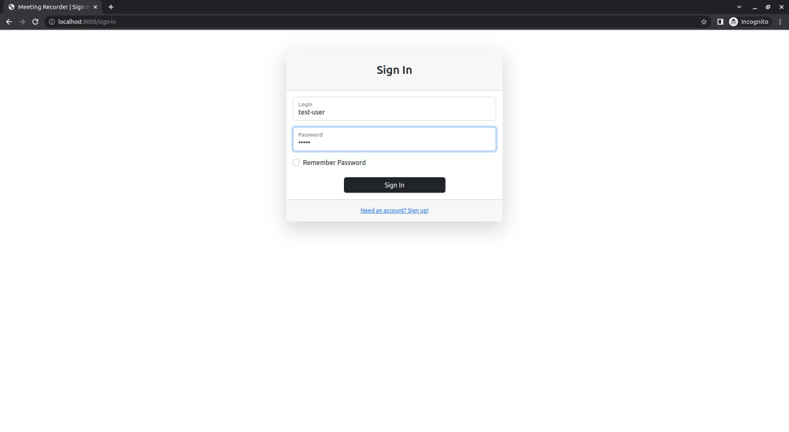
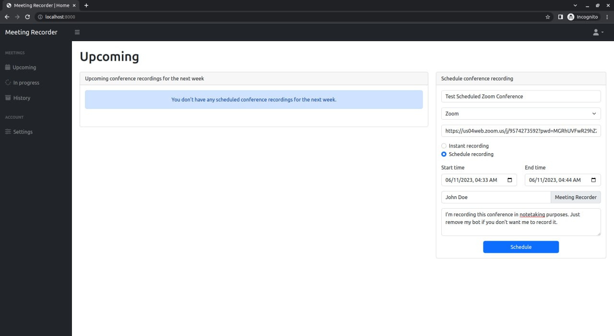
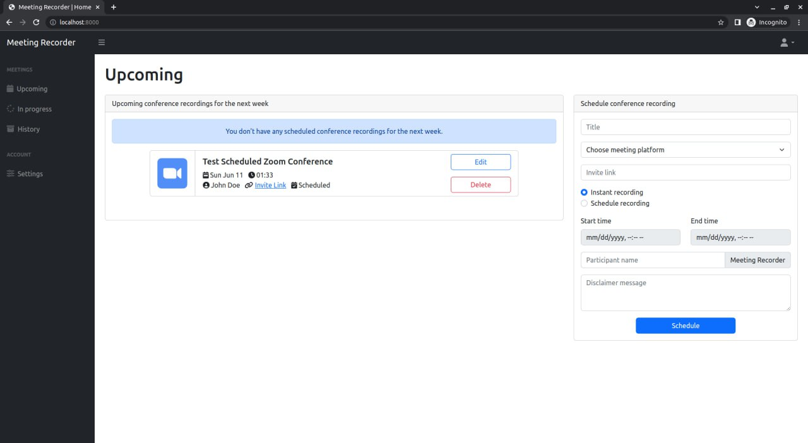
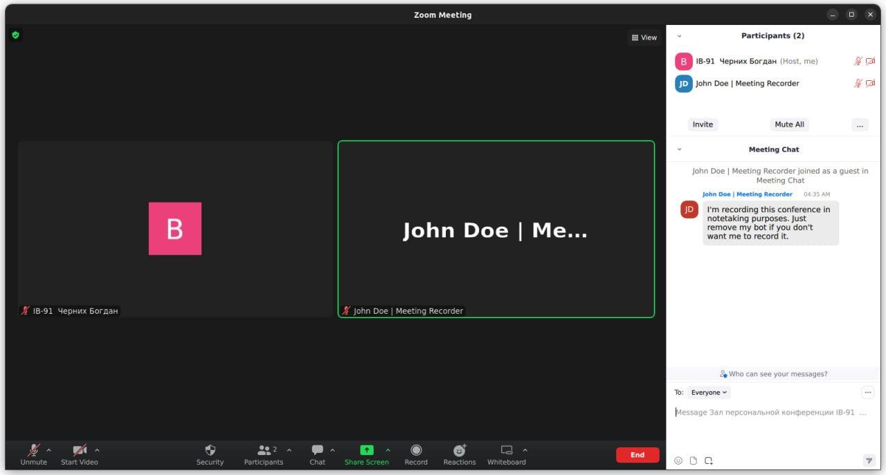
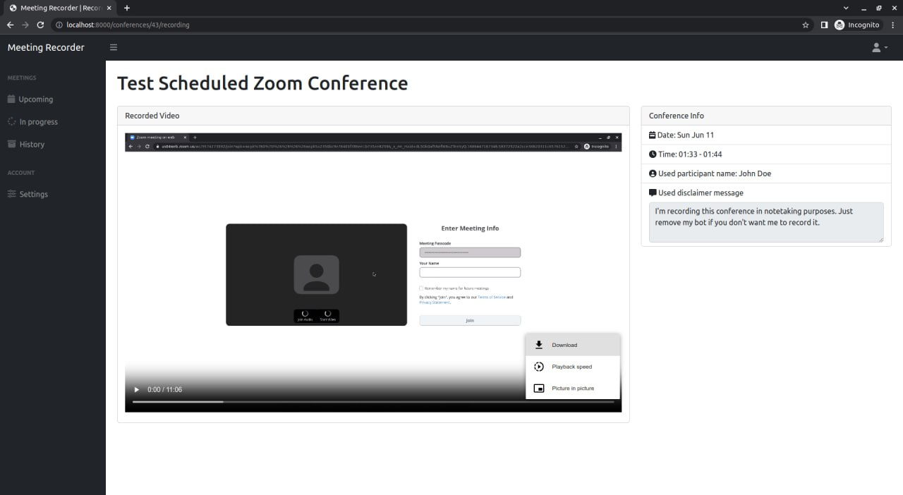

# videoconference-recording-system

## Idea

Create a web service that will allow users which are not meeting hosts to record 
meetings without actually attending them. The service should:
- support different meeting platforms to record meetings;
- allow users to schedule meeting recording and manage this scheduling;
- allow users to start immediate meeting recording;
- replay, download and delete recorded meetings;

## Current State

* The developed service supports 2 meeting platforms - Google Meet and Zoom.
* The whole system was designed using [the C4 model](https://c4model.com/).
* Tech stack: Python3, FastAPI, Postgres, Docker, Selenoid.

## How to run

1. Make sure you have Docker and Docker Compose installed.
2. Create `.env` files based on `.env.sample` in the project root 
    and in the following dirs: backend, bots-orchestrator, scheduler.
3. In `docker-compose.yml` update:
    * absolute paths of `services.selenoid.volumes` to match your needs;
    * absolute path of `OVERRIDE_VIDEO_OUTPUT_DIR` to match your needs.
    * `DOCKER_API_VERSION` to your docker api version.
4. Create external network with `docker network create selenoid`.
4. Run `docker compose up -d` to start the whole system.
5. Navigate to http://localhost:8000.

## Usage

1. Sign Up and Sign In.

2. Fill out form and schedule meeting recording

3. View scheduled recording. When it will start you can find it in "In progress" tab

4. (Optional) Verify that bot joined conference and recording is in progress

5. After meeting is finished, visit "History" tab and watch or download your meeting recording

